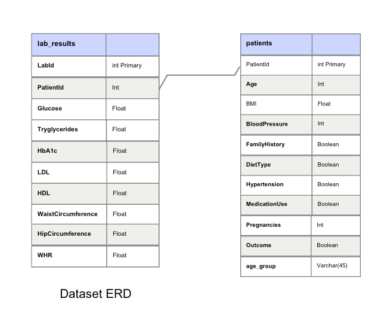
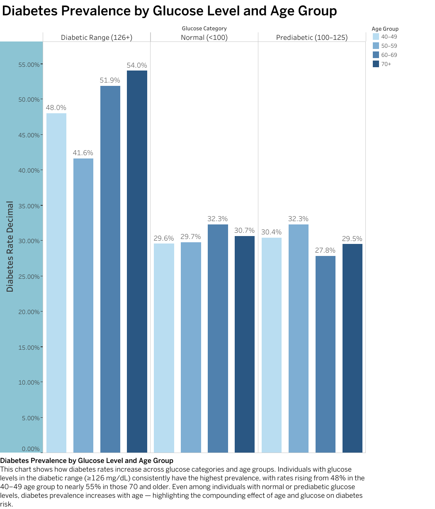
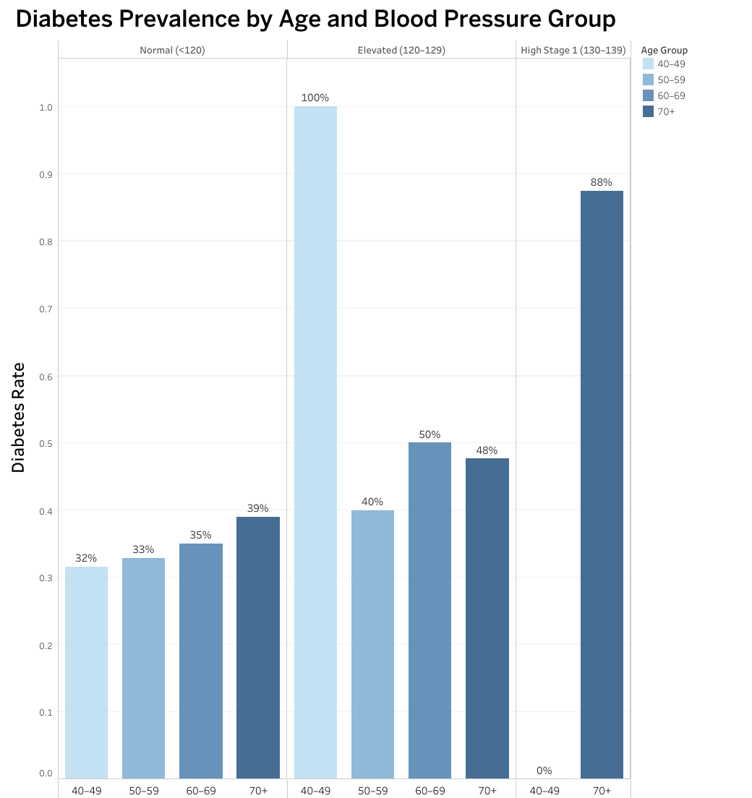
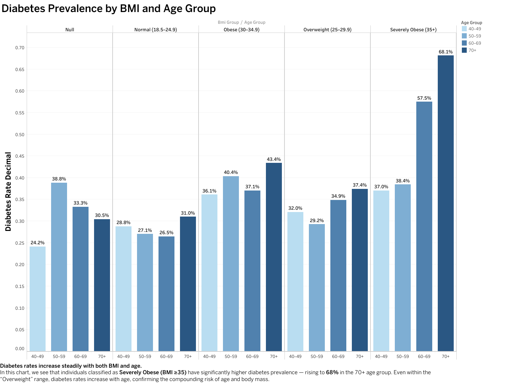
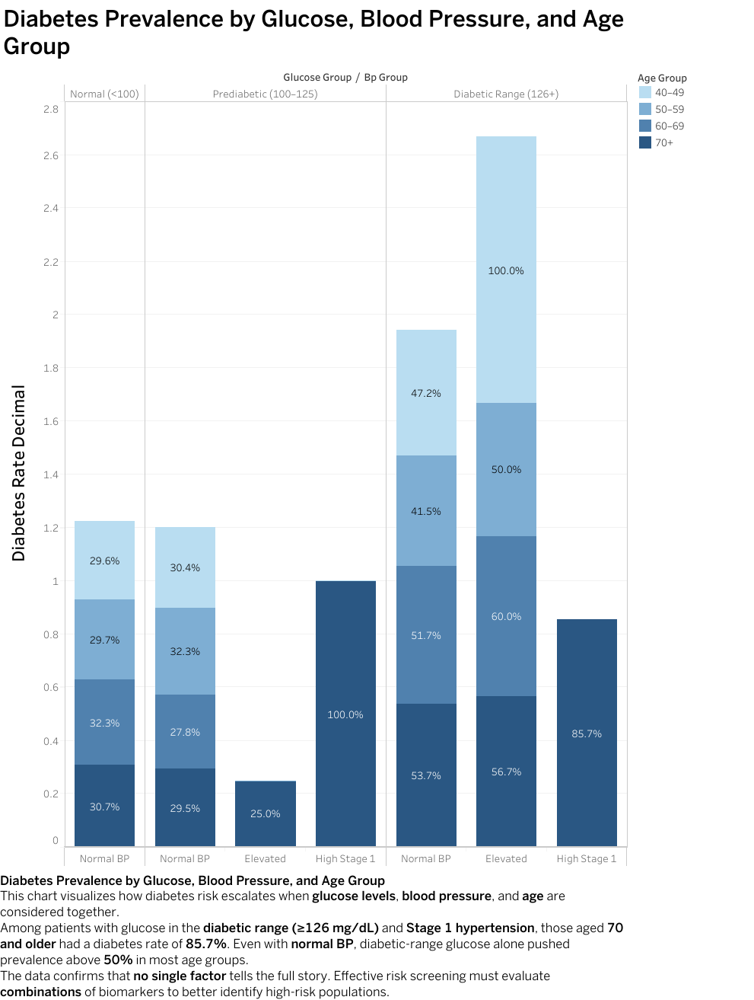
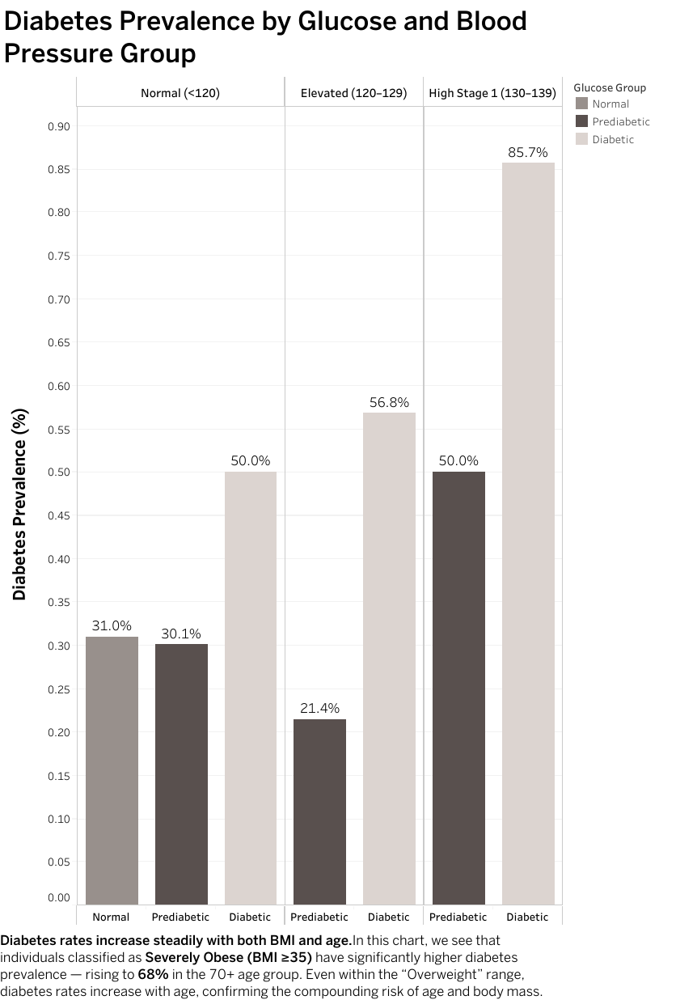

# Understanding Diabetes Risk Through Multi-Factor Analysis

## Table of Contents

- [Project Background](#project-background)
- [Data Structure & Initial Checks](#data-structure--initial-checks)
- [Executive Summary](#executive-summary)
- [Insights Deep Dive](#insights-deep-dive)
  - [Glucose Thresholds](#glucose-thresholds)
  - [Demographic Age](#demographic-age)
  - [Biometric Risk Correlation](#biometric-risk-correlation)
  - [Combined Risk Factors](#combined-risk-factors)
- [Recommendations](#recommendations)
- [Assumptions & Caveats](#assumptions--caveats)
- [Technical Resources & Links](#technical-resources--links)
- [Notes on Process](#technical-resources--links)
---

## Project Background

Elist Health is a healthcare analytics organization focused on improving early detection of chronic conditions through data. This project analyzes health records to identify biometric indicators strongly correlated with diabetes risk. The dataset includes anonymized health and demographic information on over **9,000 women**.

This project uses **SQL** and **Tableau** to:

- Identify biometric variables most predictive of diabetes.
- Uncover threshold-based risk patterns (e.g., glucose, BMI).
- Provide actionable recommendations to guide screening strategies.

Key Insight Areas:

- **Glucose Thresholds**: Diabetic prevalence across glucose levels.
- **Demographic Impact**: Age-based diabetes patterns.
- **Biometric Correlation**: Relationships between glucose, BMI, etc.
- **Multi-variable Interactions**: Age, BMI, and glucose combined analysis.

---

## Data Structure & Initial Checks
The original dataset consisted of a single table with demographic and biometric data from 9,538 individuals. To enhance clarity and facilitate analysis, the data was restructured into two logical tables during the preparation phase.
- `patients`: PatientID, age, pregnancies, blood pressure, BMI, medication use, diabetes pedigree function, diabetes outcome.
- `lab_results`: Glucose, HBA1c, LDL, HDL, Triglycerides, Waist & Hip Circumference, WHR.

To support segmentation and dashboard filtering, additional fields were created:
- **Age Group**: Categorizes patients into age brackets (e.g., 20–29, 30–39) for easier comparison.
- **BMI Category**: Underweight, Normal, Overweight, Obese.
- **IDs**: `patientID` and `labID` for unique tracking.

**SQL was used for**:

- Data cleansing
- Calculating summary metrics
- Segmenting by risk factors
- Comparing diabetic vs non-diabetic groups

**Tableau** added:

- Threshold-based visualizations
- Interactive filtering
- Storytelling of health indicator trends

---

## Executive Summary

### Overview

The analysis revealed strong correlations between diabetes risk and factors like:

- **High glucose levels**
- **Elevated BMI**
- **Age over 40**

Combined effects increase risk significantly. These insights can guide:

- Early detection efforts
- High-risk patient screening
- Patient education programs

### Key Findings

- **Glucose >120 mg/dL** → sharp increase in diabetes rates.
- **BMI >30 (Obese)** → higher diabetes prevalence.
- **Age 40+** → elevated risk, especially 60–90 age group.
- **Combined Risk**:
  - Age 70+ with glucose ≥126 & BP ≥130 → diabetes rate >85%
  - Severely obese (BMI ≥35) and 70+ → risk >68%
  - Even with normal vitals, risk grows steadily with age.

[See Project Dashboard here](https://public.tableau.com/app/profile/noemi.vargas7800/viz/UnderstandingDiabetesRisk/DiabetesRiskAnalysis?publish=yes)

## Insights Deep Dive

### Glucose Thresholds Analysis

- Glucose Levels and Diabetes Patients with glucose levels in the diabetic range (≥126 mg/dL) consistently had the highest diabetes rates, especially in older age groups. Across all ages, glucose emerged as the most directly predictive metric of diabetes status.
- Among patients aged 70+ with glucose in the diabetic range, more than 57% had diabetes. Even within "normal" glucose ranges, risk increased steadily with age.
- Diabetic prevalence peaks in the 90–110 range, with diabetic patients making up over 14% of the group.

### Demographic Age

- Age as a Risk Factor Diabetes risk rises steadily with age, with notable increases in the 60–69 and 70+ groups. Even among patients with normal glucose and blood pressure, diabetes prevalence climbs from ~29% in patients in their 40s to over 39% in those aged 70+. 
- Age alone is a meaningful flag for screening.
- Patients aged 70+ with both diabetic glucose and high blood pressure had diabetes rates over 85%.
- Prediabetic individuals (glucose 100–125) with normal BP still showed 25–30% diabetes prevalence in older age bands.

### Biometric Risk Correlation

- Glucose and BMI have strong positive correlation.
- Diabetic patients cluster in Obese and Severely Obese categories.
- Higher BMI intensifies risk at any age level.
- 

  

### Combined Risk Factors

- **High BMI + High Glucose** = highest standalone risk.
- **Systolic BP + Glucose** = especially risky for older adults.
- Diabetic patients have higher average BP than non-diabetics.

These highlight the compounding nature of diabetes risk factors.

  

---

## Recommendations

- Screen individuals with **glucose >120 mg/dL**.
- Target **BMI >30**, especially when paired with glucose elevation.
- Prioritize screening in those **aged 40+**, especially 60–90.
- Use **multi-factor flags** (glucose + BMI + BP) for risk alerts.
- Integrate thresholds into Tableau dashboards.
- Prioritize **60+ patients** when 2+ biomarkers are elevated.

[See accompanying **Tableau dashboard** for visuals.](https://public.tableau.com/app/profile/noemi.vargas7800/viz/UnderstandingDiabetesRisk/DiabetesRiskAnalysis?publish=yes)

---

## Assumptions & Caveats

- Simulated data – may not reflect full clinical diversity.
- Insulin data excluded due to quality issues.
- Cross-sectional data only — no longitudinal tracking.
- Metrics represent **single-day snapshots**.
- Visualizations rely on **grouped and aggregated** stats.

---

## Technical Resources & Links

- SQL Queries – Data Exploration & Cleaning  
- SQL Queries – Summary Metrics & Segmentation  
- [Tableau Dashboard](https://public.tableau.com/app/profile/noemi.vargas7800/viz/UnderstandingDiabetesRisk/DiabetesRiskAnalysis?publish=yes)
- [DATASETS](https://github.com/noemile8240/Understanding_Diabetes_Risks/tree/main/data)
- Notes on Process

---
